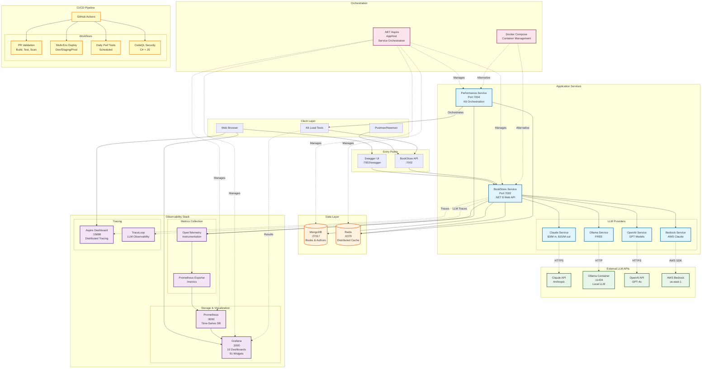
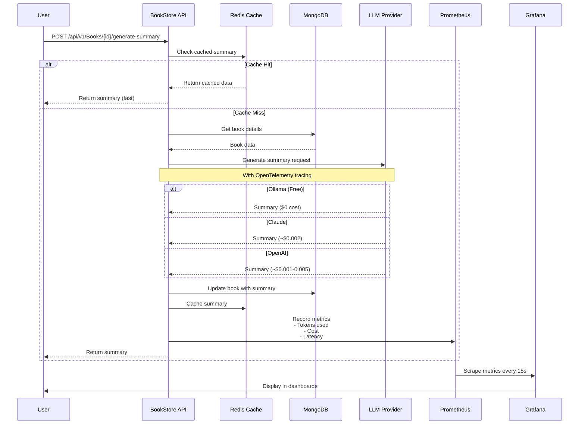
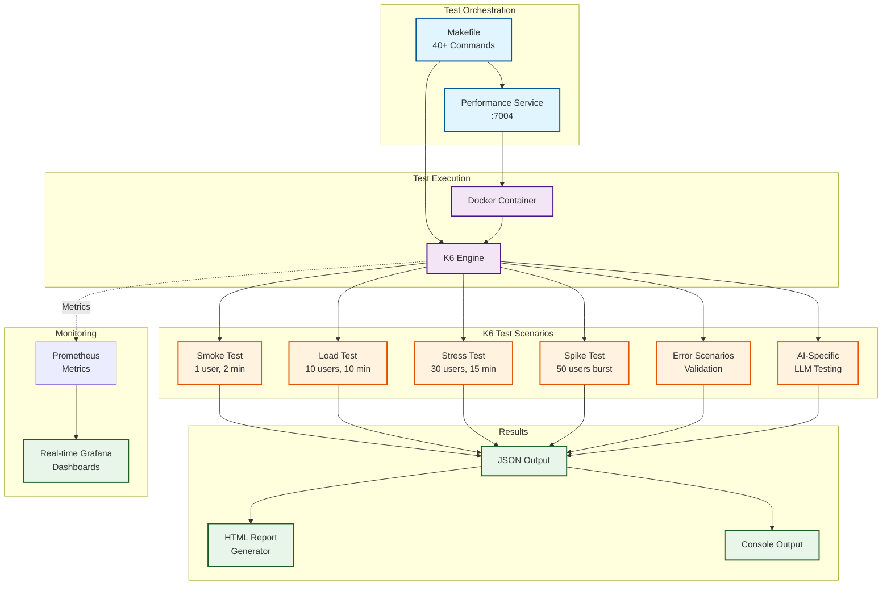
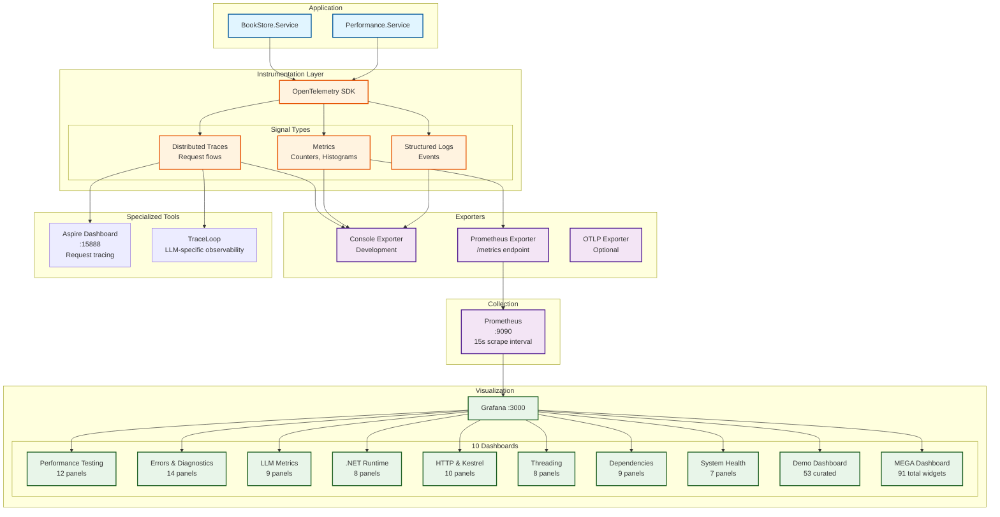
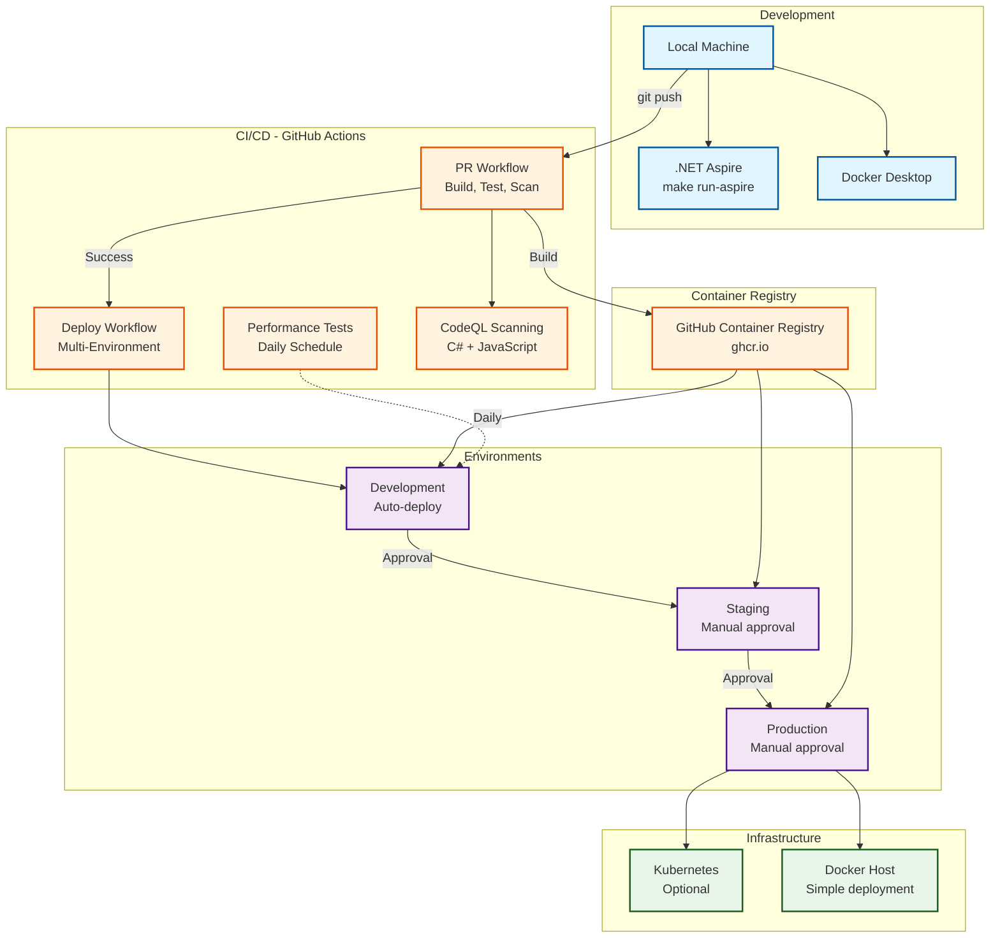
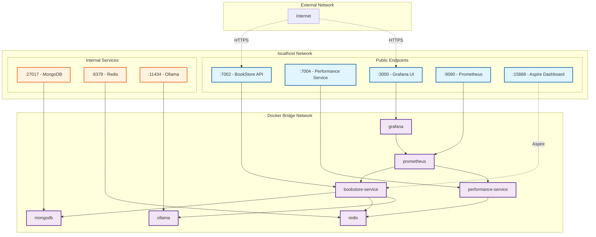

# BookStore Performance Testing POC - Architecture

## System Architecture Overview



## Data Flow Diagram



## LLM Provider Architecture

```mermaid
graph LR
    subgraph "BookStore.Service"
        Controller[Books Controller]
        Factory[LLM Service Factory]
        Interface[ILLMService Interface]
    end

    subgraph "Provider Implementations"
        Claude[ClaudeService<br/>Anthropic SDK]
        Ollama[OllamaService<br/>OllamaSharp SDK]
        OpenAI[OpenAIService<br/>OpenAI SDK]
        Bedrock[BedrockService<br/>AWS SDK]
    end

    subgraph "Configuration"
        AppSettings[appsettings.json<br/>LLM:Provider = Ollama]
    end

    subgraph "Instrumentation"
        ActivitySource[ActivitySource<br/>Distributed Tracing]
        Meter[Meter Factory<br/>Metrics]
    end

    Controller --> Factory
    Factory --> Interface
    Interface --> Claude
    Interface --> Ollama
    Interface --> OpenAI
    Interface --> Bedrock

    AppSettings -.->|Configure| Factory

    Claude --> ActivitySource
    Ollama --> ActivitySource
    OpenAI --> ActivitySource
    Bedrock --> ActivitySource

    Claude --> Meter
    Ollama --> Meter
    OpenAI --> Meter
    Bedrock --> Meter

    ActivitySource -.->|Traces| AspireDashboard[Aspire Dashboard]
    Meter -.->|Metrics| PrometheusEndpoint[/metrics]

    classDef service fill:#e1f5ff,stroke:#01579b,stroke-width:2px
    classDef config fill:#fff3e0,stroke:#e65100,stroke-width:2px
    classDef observability fill:#f3e5f5,stroke:#4a148c,stroke-width:2px

    class Claude,Ollama,OpenAI,Bedrock service
    class AppSettings config
    class ActivitySource,Meter,AspireDashboard,PrometheusEndpoint observability
```

## Performance Testing Architecture



## Monitoring & Observability Architecture



## Deployment Architecture



## Network Architecture



## Technology Stack

| Layer | Technology | Purpose |
|-------|-----------|---------|
| **Runtime** | .NET 8 | Application framework |
| **Web Framework** | ASP.NET Core | REST API |
| **Orchestration** | .NET Aspire | Service management |
| **Database** | MongoDB 7.0 | Document storage |
| **Cache** | Redis 7.2 | Distributed caching |
| **LLM - Free** | Ollama (llama3.2) | Local AI inference |
| **LLM - Cloud** | Claude, OpenAI, Bedrock | Cloud AI services |
| **Observability** | OpenTelemetry | Instrumentation |
| **Metrics** | Prometheus | Time-series data |
| **Visualization** | Grafana 10.2 | Dashboards |
| **Tracing** | Aspire Dashboard | Distributed tracing |
| **Load Testing** | K6 | Performance testing |
| **CI/CD** | GitHub Actions | Automation |
| **Containers** | Docker | Containerization |
| **API Testing** | Postman/Newman | Smoke tests |

## Port Reference

| Service | Port | Protocol | Access |
|---------|------|----------|--------|
| BookStore API | 7002 | HTTP | Public |
| BookStore API | 7001 | HTTPS | Public |
| Performance Service | 7004 | HTTP | Public |
| Performance Service | 7003 | HTTPS | Public |
| Aspire Dashboard | 15888 | HTTP | Local |
| Grafana | 3000 | HTTP | Public |
| Prometheus | 9090 | HTTP | Public |
| MongoDB | 27017 | TCP | Internal |
| Redis | 6379 | TCP | Internal |
| Ollama | 11434 | HTTP | Internal |

## File System Structure

```
/Users/j.stennett/TAIS/AiHubPerfExample/
├── BookStore.Service/                      # Main REST API
│   ├── Controllers/                        # API endpoints
│   │   └── BooksController.cs              # CRUD + AI summary
│   ├── Services/                           # Business logic
│   │   ├── ClaudeService.cs                # Claude integration
│   │   ├── OllamaService.cs                # Ollama integration
│   │   ├── OpenAIService.cs                # OpenAI integration
│   │   ├── BedrockService.cs               # AWS Bedrock
│   │   ├── LLMServiceFactory.cs            # Provider factory
│   │   └── ILLMService.cs                  # Provider interface
│   ├── appsettings.json                    # Configuration (gitignored)
│   └── appsettings.example.json            # Template
│
├── BookStore.Performance.Service/          # K6 orchestration
│   ├── Controllers/                        # Test management
│   ├── appsettings.json                    # Configuration
│   └── appsettings.example.json            # Template
│
├── BookStore.Aspire.AppHost/               # Orchestration
│   └── Program.cs                          # Service definitions
│
├── BookStore.Common/                       # Shared models
│   └── Models/                             # Book, Author
│
├── BookStore.Common.Instrumentation/       # OpenTelemetry
│   ├── OpenTelemetryExtensions.cs          # Setup
│   ├── TelemetrySettings.cs                # Configuration
│   └── TraceTags.cs                        # Semantic conventions
│
├── BookStore.Performance.Tests/            # K6 tests
│   ├── tests/                              # Test scripts
│   ├── scenarios/                          # Load patterns
│   ├── utils/                              # Helpers
│   └── generate-html-report.js             # Report generator
│
├── monitoring/                             # Observability config
│   ├── grafana/
│   │   ├── dashboards/                     # 10 JSON dashboards
│   │   ├── generate_dashboards.py          # Dashboard generator
│   │   └── datasources/                    # Prometheus config
│   └── prometheus/
│       └── prometheus.yml                  # Scrape config
│
├── .github/workflows/                      # CI/CD
│   ├── pr.yaml                             # PR validation
│   ├── deploy.yaml                         # Multi-env deploy
│   ├── performance.yaml                    # Daily tests
│   └── codeql.yaml                         # Security scanning
│
├── Makefile                                # 40+ automation commands
├── docker-compose.perf.yml                 # Full stack
├── README.md                               # Project overview
├── SETUP.md                                # Setup guide
├── CLAUDE.md                               # Development instructions
├── MONITORING_COMPARISON.md                # vs hub-services-latest
├── TRICENTIS_API_SIMULATOR_PLAN.md        # Future integration
└── ARCHITECTURE.md                         # This file
```

## Key Architectural Decisions

### 1. Multi-LLM Provider Strategy
- **Decision**: Support 4 LLM providers with unified interface
- **Rationale**: Flexibility, cost optimization, avoid vendor lock-in
- **Implementation**: Factory pattern with `ILLMService` interface

### 2. Ollama as Default
- **Decision**: Use free local Ollama by default
- **Rationale**: Zero cost for development and performance testing
- **Trade-off**: Slightly lower quality vs Claude, but unlimited usage

### 3. .NET Aspire for Orchestration
- **Decision**: Use Aspire over pure Docker Compose
- **Rationale**: Better .NET integration, built-in dashboard, easier debugging
- **Fallback**: Shell scripts provided when Aspire has issues

### 4. Prometheus + Grafana over Coralogix
- **Decision**: Self-hosted observability stack
- **Rationale**: $200-500/month cost savings, full control, portable
- **Benefit**: Same OpenTelemetry semantic conventions as hub-services-latest

### 5. K6 for Performance Testing
- **Decision**: K6 over JMeter or Gatling
- **Rationale**: JavaScript-based, modern, excellent HTTP/2 support
- **Integration**: Docker orchestration via Performance Service

### 6. OpenTelemetry Semantic Conventions
- **Decision**: Follow OpenTelemetry standard for LLM metrics
- **Rationale**: Industry standard, compatible with hub-services-latest
- **Tags**: `gen_ai.*`, `llm.*`, cost tracking, token counts

### 7. Configuration-Based Provider Selection
- **Decision**: Runtime provider switching via appsettings.json
- **Rationale**: No code changes needed, easy A/B testing
- **Pattern**: `LLM:Provider = "Ollama"` or query param `?provider=claude`

## Future Enhancements (Roadmap)

### Phase 1: API Simulator Integration
- Add Tricentis API Simulator support
- Zero-cost LLM mocking for CI/CD
- Simulation library from production traces
- Timeline: 2-3 days (see TRICENTIS_API_SIMULATOR_PLAN.md)

### Phase 2: Advanced Monitoring
- Custom metrics for business KPIs
- Alerting rules in Prometheus
- SLO/SLI tracking dashboards
- Timeline: 1 week

### Phase 3: Kubernetes Deployment
- Helm charts for K8s
- Horizontal pod autoscaling
- Service mesh integration (Linkerd/Istio)
- Timeline: 2 weeks

### Phase 4: Advanced LLM Features
- Streaming responses
- Token rate limiting
- Cost budgets per tenant
- A/B testing framework
- Timeline: 2 weeks

## Quick Reference

### Start Everything
```bash
make run-aspire      # Start with Aspire (recommended)
make run-services    # Start with shell scripts (fallback)
```

### Access Dashboards
```bash
make grafana-mega        # All 91 widgets
make grafana-dashboards  # Open all 8 specialized
make aspire-dashboard    # Request tracing
```

### Run Tests
```bash
make perf-smoke          # Quick validation
make perf-comprehensive  # Full test suite
make test-integration    # .NET integration tests
```

### Monitor Services
```bash
make status              # Check all services
make health-check        # Test endpoints
make logs-bookstore      # View logs
```

## Related Documentation

- **README.md** - Quick start and features
- **SETUP.md** - Detailed setup instructions
- **CLAUDE.md** - Development guidelines for AI assistants
- **MONITORING_COMPARISON.md** - Comparison with hub-services-latest
- **TRICENTIS_API_SIMULATOR_PLAN.md** - API simulator integration plan
