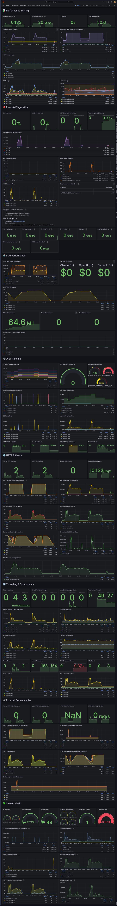

# BookStore Performance Testing POC

Enterprise-grade .NET 8 performance testing application demonstrating production-ready monitoring, CI/CD, and multi-LLM support.

## Quick Start

```bash
# Setup and start (auto-cleans MongoDB, starts all services)
make run-aspire

# Open performance testing workspace (Dashboard + Grafana + Aspire)
make perf-workspace

# Run quick test
make perf-ai-smoke
```

**📖 Documentation:**
- **[Makefile Reference](docs/MAKEFILE_REFERENCE.md)** - Complete command guide
- **[LLM Provider Guide](docs/LLM_PROVIDER_GUIDE.md)** - Setup Ollama, LM Studio, Claude, etc.
- **[CLAUDE.md](CLAUDE.md)** - Full project documentation

**Quick Access:**
- API: <http://localhost:7002/swagger>
- Aspire Dashboard: <http://localhost:15888>
- Grafana: <http://localhost:3333> (admin/admin123)
- Prometheus: <http://localhost:9090>
- K6 Web UI: <http://localhost:7004>

**Key Dashboards:**
```bash
make grafana-mega        # All 91 widgets in one view
make perf-workspace      # Dashboard + Grafana + Aspire (3 tabs)
```

## Architecture

### Services

- **BookStore.Service** - REST API with CRUD + AI summaries
- **BookStore.Performance.Service** - K6 test orchestration
- **BookStore.Aspire.AppHost** - .NET Aspire orchestration

### Infrastructure

- **MongoDB** - Primary database
- **Redis** - Distributed caching
- **Ollama** - Free local LLM (default, $0 cost)
- **Prometheus** - Metrics collection
- **Grafana** - Dashboards & visualization
- **K6** - Load testing

### Observability Stack

- **OpenTelemetry** - Traces, metrics, logs
- **TraceLoop** - LLM-specific observability
- **Semantic Conventions** - Standard gen*ai.*, llm.\_ tags
- **Real-time Cost Tracking** - Token usage & API costs

## LLM Support (Multi-Provider)

**📖 Complete guide: [docs/LLM_PROVIDER_GUIDE.md](docs/LLM_PROVIDER_GUIDE.md)**

### Supported Providers

1. **Ollama** - Free local models (llama3.2, gemma3:1b, mistral)
2. **LM Studio** ⭐ - Free local models with hundreds of options
3. **Claude** - Anthropic API (claude-3-5-sonnet-20241022)
4. **OpenAI** - GPT models (gpt-4o, gpt-4o-mini)
5. **Bedrock** - AWS-hosted models

### Quick Provider Setup

1. Edit `BookStore.Service/appsettings.json`
2. Set `LLM.Provider` to: `"Ollama"`, `"LMStudio"`, `"Claude"`, `"OpenAI"`, or `"Bedrock"`
3. Configure provider-specific settings in `LLM.Providers` section
4. Restart: `make run-aspire`

**Zero-Cost Testing:**
```bash
# Ollama (fastest setup)
ollama pull gemma3:1b
# Set Provider: "Ollama" in appsettings.json

# LM Studio (most flexible)
# Download from lmstudio.ai
# Load any model, start server
# Set Provider: "LMStudio" in appsettings.json
```

## Performance Testing

### K6 Scenarios

```bash
make perf-smoke         # 1-2 users, 2 min
make perf-load          # 10 users, 10 min
make perf-stress        # 30 users, 15 min
make perf-spike         # Burst to 50 users
make perf-ai-smoke      # LLM endpoint test
make perf-errors        # Error handling validation
make perf-comprehensive # All tests (~30 min)
```

### Test Features

- Multiple user profiles (reader, librarian, manager)
- Mixed workloads (CRUD + AI operations)
- Error scenario testing
- HTML reports with percentiles
- Real-time Grafana dashboards

## CI/CD (GitHub Actions)

### Workflows

- **pr.yaml** - Build, test, lint, Docker, K6, security scan
- **deploy.yaml** - Multi-env deployment (dev/staging/prod)
- **performance.yaml** - Daily scheduled performance tests
- **codeql.yaml** - Security scanning (C# + JS)
- **dependabot.yml** - Automated dependency updates

### Features

- Docker image publishing to GHCR
- Code coverage with Codecov
- Trivy security scanning
- Parallel job execution
- Environment-specific approvals

## Monitoring

### Grafana Dashboards (10 Total)

**Specialized Dashboards (8):**

1. **Performance Testing** - Request rates, latency percentiles, throughput
2. **Errors & Diagnostics** - HTTP status codes (400, 401, 404, 409, 410, 422, 500, 503), .NET exceptions, debugging links
3. **LLM Metrics** - Token usage, costs, provider comparison, request duration
4. **.NET Runtime** - GC, memory, assemblies, exception tracking
5. **HTTP & Kestrel** - Server performance, connection pools, request queue
6. **Threading & Concurrency** - Thread pools, lock contention, work items
7. **External Dependencies** - MongoDB, Redis, HTTP client metrics
8. **System Health** - CPU, memory, process stats, uptime

**Overview Dashboards (2):**

1. **Demo Dashboard** - 53 curated panels (highlights for quick demos)
2. **MEGA Dashboard** - All 91 widgets in one scrollable view

### Quick Access

```bash
make grafana-mega        # MEGA: All 91 widgets
make grafana-demo        # Demo: 53 highlights
make grafana-dashboards  # Open all 8 specialized
make grafana             # Grafana home
```

### Prometheus Metrics

- 36+ metric types (runtime, HTTP, custom)
- Token counters: `claude.tokens.*`, `ollama.tokens.*`
- Cost histogram: `claude.cost.usd`, `ollama.cost.usd`
- HTTP duration: `http_server_request_duration_seconds`

### Example Results

- **540 LLM requests = $0.99** (Claude)
- **Unlimited requests = $0** (Ollama)
- P95 latency: 8s (LLM), 50ms (CRUD)

## Development

### Prerequisites

- .NET 8 SDK
- Docker Desktop
- K6 (`brew install k6`)

### Commands

```bash
make help               # Show all 40+ commands
make dev-setup          # Install dependencies
make build              # Build solution
make test               # Run tests
make format             # Format code
make status             # Check service health
make logs-bookstore     # View logs
make docker-clean       # Reset everything
```

### MongoDB Fix

MongoDB volumes auto-clean on startup via `start-aspire.sh` to prevent auth issues.

## Project Structure

```yaml
├── BookStore.Service/                # Main API
│   ├── Controllers/                  # REST endpoints
│   ├── Services/                     # Business logic + LLM services
│   └── appsettings.json              # Configuration
├── BookStore.Common/                 # Shared models
├── BookStore.Common.Instrumentation/ # OpenTelemetry setup
├── BookStore.Performance.Tests/      # K6 tests
│   ├── tests/                        # Test scenarios
│   ├── scenarios/                    # Load patterns
│   ├── utils/                        # Helpers
│   └── generate-html-report.js       # Report generator
├── BookStore.Aspire.AppHost/         # Aspire orchestration
├── monitoring/
│   ├── grafana/dashboards/           # 10 dashboards (91 total widgets)
│   ├── grafana/*.py                  # Dashboard generation scripts
│   └── prometheus/prometheus.yml     # Scrape config
├── .github/workflows/                # CI/CD (5 workflows)
├── Makefile                          # 40+ automation commands
├── MONITORING_COMPARISON.md          # vs hub-services-latest
└── docker-compose.perf.yml           # Full stack + Ollama
```

## Key Features vs hub-services-latest

### Better

- ✅ Prometheus + Grafana (vs expensive Coralogix)
- ✅ Local monitoring stack
- ✅ K6 performance testing
- ✅ HTML test reports
- ✅ Ollama for free testing
- ✅ Cost tracking dashboards
- ✅ GitHub Actions CI/CD

### Same

- ✅ OpenTelemetry semantic conventions
- ✅ TraceLoop integration
- ✅ Health checks
- ✅ Multi-provider LLM support

### Cost Savings

**$200-500/month** - Open-source stack vs Coralogix subscription

## Documentation

- **CLAUDE.md** - Project instructions for AI assistants
- **MONITORING_COMPARISON.md** - Detailed comparison with hub-services-latest
- **LLM_TESTING.md** - LLM performance testing guide
- **Makefile help** - `make help` for all commands

## Troubleshooting

### MongoDB Auth Issues

```bash
# Auto-fixed by start-aspire.sh
make run-aspire  # Cleans volumes automatically
```

### Services Not Starting

```bash
make status       # Check what's running
make health-check # Test endpoints
make logs-bookstore  # View logs
make restart      # Stop and restart
```

### Port Conflicts

```bash
lsof -Pi :7002   # Check API port
lsof -Pi :11434  # Check Ollama port
```

## Latest Mega Dashboard

_All monitoring widgets in one comprehensive view - from performance metrics to error tracking to LLM costs._


